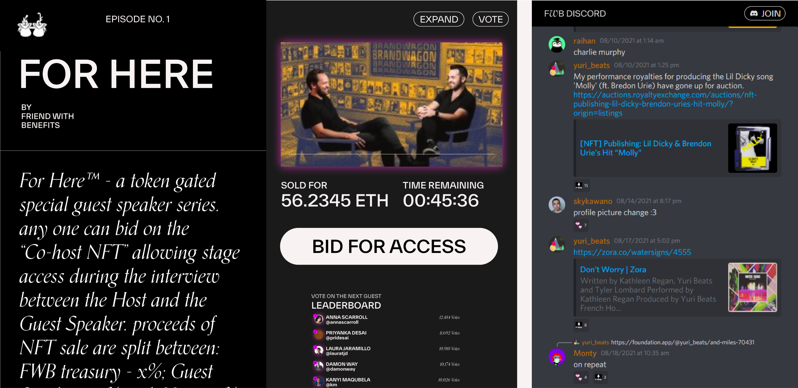
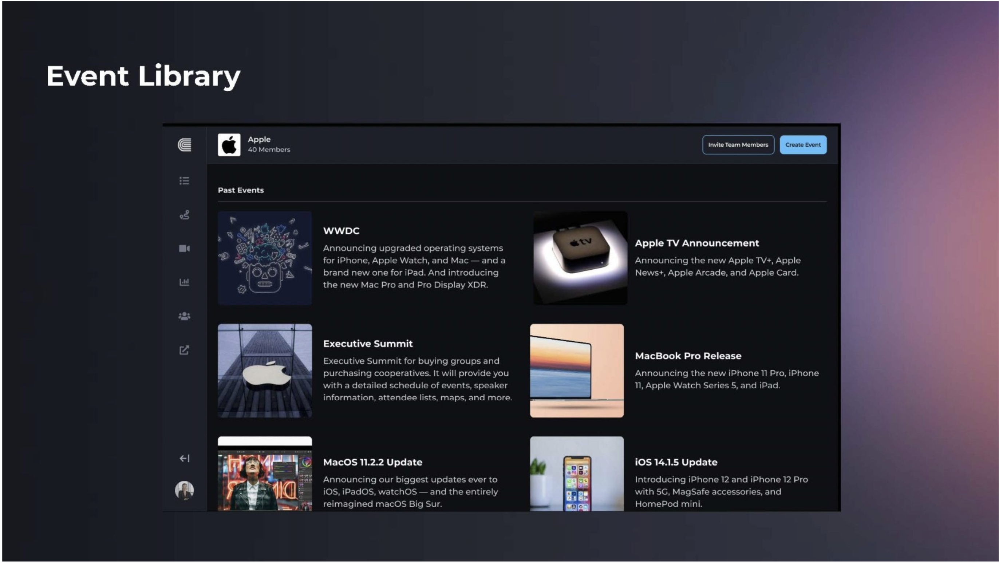
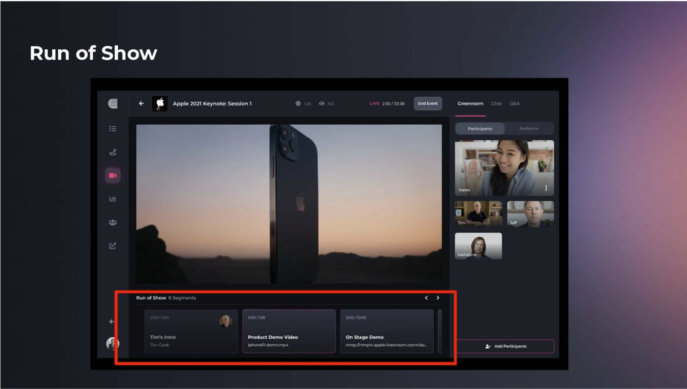
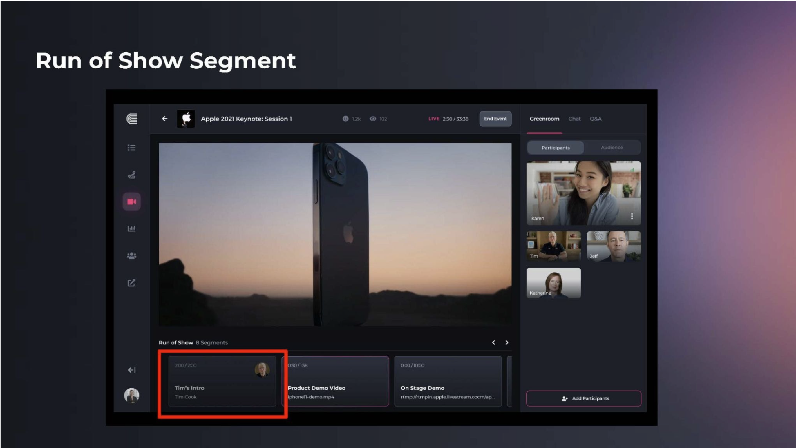
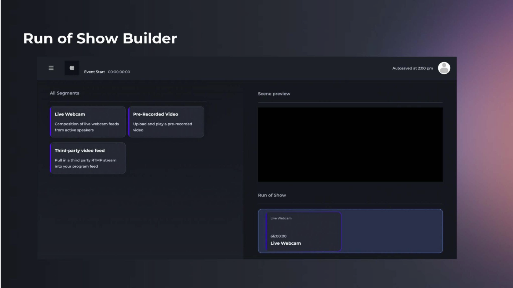
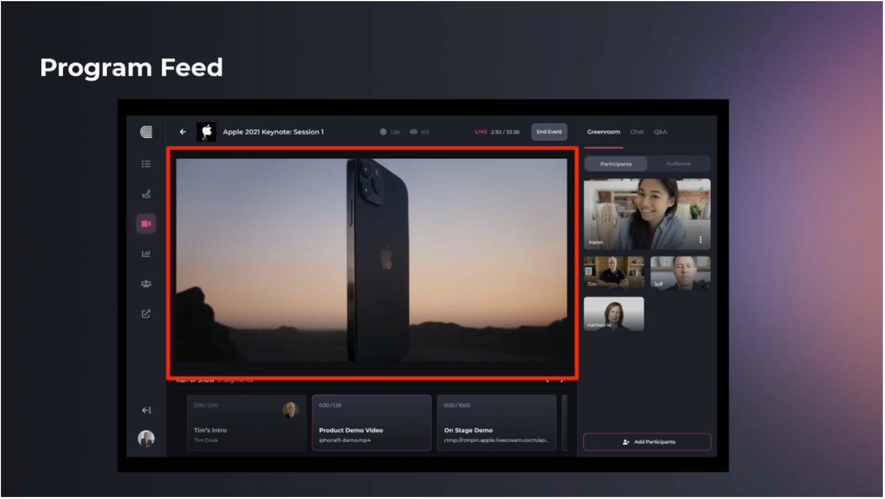

# FWB Coffee Time: For Here Series
**Team**:  
Courtney (crbl00m)    
Khayyam  (iamkhayyam)   
Brian  (idislikebrian)  
Karina  (karinaraf)   
Matt  (flanman) 

### tl;dr  
A token gated special guest series where the FWB community PartyBids on NFTs to schedule speaking events in a crowdsourced and democratic way. Once the reserve price is met, a DAO forms between the speaker and their prospective audience. These commemorative multimedia tokens exist as curative pieces in any NFT collection but also serve as keys to an intimate experience between creators and their community. WIth simple DAO governance tools, the audience can crowd source the best questions for the Q&A session, even elect 3rd and 4th chair seats to the most engaged users in the token-gated Discord channel. Most importantly, it gives creators and their fans an experience and canvas to congregate and collaborate. 

### Abstract  
We're excited to introduce For HereTM , a special guest speaker series curated by the FWB community. The motivation behind this project is simple, how do we introduce more interesting people and communities to FWB while highlighting and leveraging the existing network and infrastructure FWB provides?  

The schedule of For HereTM events will be curated and marketed by minting NFTs on the Zora marketplace to announce future guests. By scheduling and collaboarting with artists beforehand, we can come up with performance KPIs to measure how well they engage with their current audience and bring in capital to the ParyBid (affiliate links, etc.) a signal of interest. This could be an interesting lever experimenting with how to best incentivize creators with larger pools of the initial $ToGo Tokens. These stipulations could certainly be writen into the formation contracts for DAO treasuries:

- Winning the monthly nomination from the FWB community triggers the outreach process and negotiation for the reserve price of the NFT. Reserve price must cover  5% PartyBid Fee, 5% FWB fees, with the remaining 90% of capital raised to be divided amongst the DAO.
- Terms negotiated for might include: up front pre-token % fee, size of allocation once NFT auction is complete
- Example terms
  - **Initial reserve price set**: 1 ETH (_those eager to speak could set the floor as low as 0.1 ETH_)
  - **Affiliate link sign-up**: awarded pre-token fee 1-5% // 0 - 150 people
  - **Total sign ups**: gifted 25-50% of tokens // 0 - 300 people
  

Using the PartyBid protocols, audiences will be able to come together to collectively bid on an NFT representing a future speaking engagement to incentivize their favorite artists/creators to come and participate with the community in the auction and resulting DAO. If the reserve price is met, ownership of the NFT is passed to the members of this newly formed DAO, where they can join a token-gated Discord channel to interact with the speaker and other event organizers to curate the live event to be structured in the way they want.

The live event will be a conversation between the special guest and the portion of the audience collectively represented as $ToGo token holders of the organizing DAO, some of whom may even be on stage as 3rd chair with Derek, current host of FWB Coffee Time, moderating. After the predetermined time has expired, $ToGo token holders will have acess 

### Pulse Dashboard
  
  
The speaker proposal process begins within the Pulse dashboard, here we can see a snippet of what it would look like during the sourcing stage. We would like to open up to the FWB community for a list of nominees which will be voted on in the Coffee Time channel using a tool similar to Sesh:.  speaker proposal receiving the highest number of votes will be chosen as next month's guest, setting off the marketing operation of this product.

Early partnership with the members of FWB will be critical for this first cohort of guests.
# The NFT
 
## PartyBid
PartyBid is a protocol that allows a group of internet homies to pool their funds together in order to win an NFT auction.
At the end of the voting period, an NFT representing this future event will be minted on Zora and a PartyBid will be initiated with the intent to purchase it.

## PartyDAO 🥳
PartyBid is the first product developed by PartyDAO, a decentralized autonomous organization that builds and ships products. PartyDAO was [created initially](https://d.mirror.xyz/FLqkPA3iN4x-p97UhfhWwaCx8rBmVo-1yttY20oaob4) for the purpose of shipping PartyBid.
To keep up with PartyDAO, follow [@prtyDAO](https://twitter.com/prtyDAO) on Twitter and [Mirror](https://party.mirror.xyz/). Acquire 10 [$PARTY tokens](https://etherscan.io/token/0x402eb84d9cb2d6cf66bde9b46d7277d3f4a16b54?a=0x2f4bea4cb44d0956ce4980e76a20a8928e00399a) to join the DAO and party with us.

## Features
- A PartyBid contract is deployed targeting a single NFT auction
- Anyone can contribute ETH to the PartyBid while the auction is still live
- Anyone who has contributed to the PartyBid can trigger a bid on the targeted NFT auction
- After the auction closes, if the PartyBid won the NFT, the token is fractionalized; all contributors whose funds were used to win the auction are rewarded with ERC-20 tokens representing a fractionalized share of the NFT. Tokens are fractionalized using [fractional.art contracts](https://github.com/fractional-company/contracts)
- If a PartyBid wins the NFT, a 5% fee is paid to the PartyDAO multisig 

Once the reserve price is met (covering FWB overhead costs, PartyBid platform fee, speaker fee, etc.), the bid will be placed. If the auction is won, any contributor can return to claim their "$TOGO" tokens, relative to the amount contributed. If the reserve price isn't met, or another DAO collectively outbids the PartyBid, any contributors can return and reclaim the ETH they contributed.  

As previously mentioned, collaboration will be key for the early days of HotTakes. While this crowdfunding mechanism can be a powerful tool to attract guests, it'll be important to have precommited speakers who are willing to participate in the DAO with their excited future audience members.
We would like to open up to the FWB community for a list of nominees.

### The DAO
Token Holders will be able to connect their wallets to join a token-gated Discord server dedicated to their upcoming event. This server will be the first chance token holders will have to interact with each other and their future speaker. Token weighted governance protocols can be used to determine everything from what topics they want to be covered to who else will join their speaker on stage.

### The Event
1-hour long conversation with the speaker of choice and chosen members of the newly formed DAO moderated by Derek. After having a say in structure, topics and questions beforehand, token holders will be shown in "the front row" and have their questions answered first during the Q&A session. During the call, non-token holding attendees will have the opportunity to purchase tokens from a pool set aside by the speaker for any others who missed the PartyBid.  

While hosted on the FWB programming and servers, the event will be run on the Cadenza plaftorm, a new tool which we think has a lot of the functionality needed to stand this project up. 

#### Cadenza

1. **Event Library** 
   * dashboard with past, upcoming, and live events
   

2. **Run-of-Show** -
   * Drag-and-drop segment types into the timeline
   * Supported segment types:
     * Live webcam
       * pulls in speaker's webcam feed
     * Pre-recorded video
       * upload a video that will automatically play when in timeline
     * Third-Party video feed
       * pull in a third party livestream into the feed
     * Autosaving
       * Any progress while building out Run-of-Show will be automatically saved  

3. **Studio**
   * Start and end livestream
     * see and converse with active speakers
     * mute/unmute, camera on/off, share screen
   
   * Run-of-show
     * click on an a segment to activate it within the program feed (override)
     * displays the livestream feed that all attendees will see on the Event Page

4. **Speaker Management**
   * Invite speakers to event

5. **Event Page**
   * Public and private event types
     * Public
       * Can be ticketed events or free
     * Private
       * Must be accessed via access code / tokengating
     * Chat / Q&A
     * Replay video recordings after event ends

### The Greenroom
At the end of the event, token holders will have access to a 30-minute "Greenroom" extended Q&A session with the speaker. This gives token holders another chance to have an intimate discussion with the host, thank them for their time, and make plans for the future of their DAO.

### The Future
