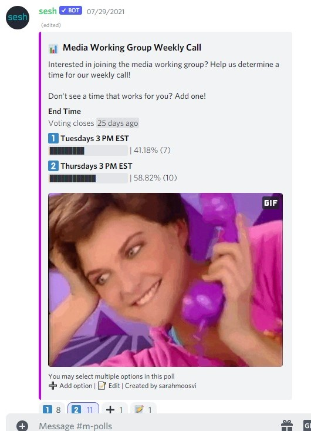

# FWB Coffee Time: HotTakes Series
**Team**:  
Courtney (crbl00m)  [Twitter]() || [LinkedIn]()  
Khayyam  (iamkhayyam)  [Twitter]()  || [LinkedIn]()  
Brian  (idislikebrian)  [Twitter]()  || [LinkedIn]()  
Karina  (karinaraf)  [Twitter]()  || [LinkedIn]()  
Matt  (flanman) [Twitter]()  || [LinkedIn]()  

### tl;dr  
A token gated special guest series where the FWB community PartyBids on their most desired speakers for a multimedia live event.  

### Abstract  
We're excited to introduce HotTakesTM, a special guest speaker series curated by the FWB community. The motivation behind this project is simple, how do we introduce more interesting people and communities to FWB while highlighting and leveraging the existing network and infrastructure FWB provides?  

Combining Zora and PartyBid protocols, audiences will be able to come together to collectively bid on an NFT representing a future speaking engagement to incentivize their favorite artists/creators to come and share their HotTakes with the community. If the reserve price is met, ownership of the NFT is passed to the members of this newly formed DAO, where they can join a token-gated Discord channel to interact with the speaker and other event organizers to curate the live event to be structured in the way they want.

The live event will be ???

### The Speakers
Early partnership with the members of FWB will be critical for this first cohort of guests. We would like to open up to the FWB community for a list of nominees which will be voted on in the Coffee Time channel using a tool similar to Sesh:  
  
The speaker proposal receiving the highest number of votes will be chosen as next month's guest, setting off the marketing operation of this product.

### The NFT
At the end of the voting period, an NFT representing this future event will be minted on Zora and a PartyBid will be initiated with the intent to purchase it. Once the reserve price is met (covering FWB overhead costs, PartyBid platform fee, speaker fee, etc.), the bid will be placed. Once the auction is won, any contributor can return to claim their tokens, relative to the amount contributed.   

As previously mentioned, collaboration will be key for the early days of HotTakes. While this crowdfunding mechanism can be a powerful tool to attract guests, it'll be important to have precommited speakers who are willing to participate in the DAO with their excited future audience members.

### The DAO
Token Holders will be able to connect their wallets to join a token-gated Discord server dedicated to their upcoming event. This server will be the first chance token holders will have to interact with each other and their future speaker. Token weighted governance protocols can be used to determine everything from what topics they want to be covered to who else will join their speaker on stage.

### The Event
1-hour long conversation with the speaker of choice and chosen members of the newly formed DAO moderated by Derek. After having a say in structure, topics and questions beforehand, token holders will be shown in "the front row" and have their questions answered first during the Q&A session. During the call, non-token holding attendees will have the opportunity to purchase tokens from a pool set aside by the speaker for any others who missed the PartyBid.  

### The Greenroom
At the end of the event, token holders will have access to a 30-minute "Greenroom" extended Q&A session with the speaker. This 

### The Future
